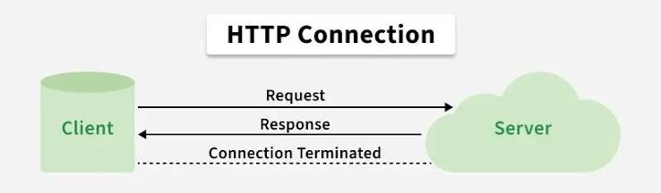
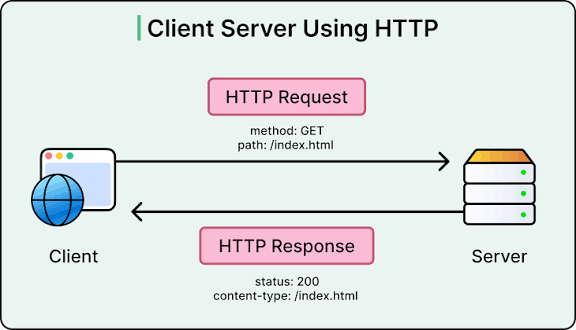

 ##   Async Js (Under the Hood ) MODULE 1 :
    ---- Synchronous vs. Asynchronous (Non-blocking principle) 
JavaScript is a **single-threaded**, **synchronous** programming language by default. It possesses a single **Call Stack**, meaning it can execute only one piece of code at a time.

---

## 1. Synchronous vs. Asynchronous Execution

* **Synchronous (Blocking):** Code is executed line-by-line in sequential order.
 A long-running task blocks all subsequent execution until it completes.
* **Asynchronous (Non-Blocking):** Time-consuming operations (e.g., Network Requests, Timers)
 are delegated to background browser threads, allowing the main thread to continue executing code without freezing the UI.

---

## 2. V8 Runtime Architecture & The Event Loop

The JavaScript runtime consists of four main components:

1. **Call Stack:** Executes code sequentially using LIFO (Last In, First Out) stack order.
2. **Web APIs:** Container provided by the browser (C++ environment) handling background operations like `setTimeout`, `fetch()`, and DOM events.
3. **Callback Queues:**
   * **Microtask Queue:** High-priority queue reserved exclusively for **Promises** (`.then`, `async/await`) and `queueMicrotask`.
   * **Macrotask (Task) Queue:** Lower-priority queue for timers (`setTimeout`, `setInterval`) 
   and I/O events.
4. **Event Loop:** A continuous process monitoring the Call Stack. Once the Call Stack 
is completely empty, it pushes callbacks from the queues into the stack using strict priority rules.

> **Golden Rule of Priority:**
> `Microtask Queue` has absolute priority over `Macrotask Queue`. The Event Loop empties the entire Microtask Queue before processing a single Macrotask.

---

## 3. Code Example: Execution Order & Queue Priority

```js
console.log('1. Synchronous Start');

// Macrotask (Scheduled in Web APIs -> Macrotask Queue)
setTimeout(() => {
  console.log('4. Macrotask: setTimeout Callback');
}, 0);

// Microtask (Scheduled directly in Microtask Queue)
Promise.resolve().then(() => {
  console.log('3. Microtask: Promise Callback');
});

console.log('2. Synchronous End');

/*
Output Order:
1. Synchronous Start
2. Synchronous End
3. Microtask: Promise Callback
4. Macrotask: setTimeout Callback
*/


  ## MODULE 2: The Evolution of Async Code

Async JavaScript evolved through three main eras to address code 
readability, maintainability, and error handling.

---

## 1. Callbacks & Callback Hell

A **Callback** is a function passed as an argument to 
another function to be executed once an async operation finishes.

* **Issue:** Nesting multiple asynchronous callbacks leads to
 **Callback Hell** (Pyramid of Doom), making error handling extremely complex and code unreadable.

---

## 2. Promises (ES6)

A **Promise** is a JavaScript object representing the
 eventual completion (or failure) of an asynchronous operation.

### Lifecycle States:
* **`Pending`:** Initial state, operation is ongoing.
* **`Fulfilled`:** Operation succeeded (`resolve()` called) -> triggers `.then()`.
* **`Rejected`:** Operation failed (`reject()` called) -> triggers `.catch()`.

```javascript
// Promise Chaining
fetchUser(1)
  .then(user => fetchPosts(user.id))
  .then(posts => console.log(posts))
  .catch(error => console.error(error));
```
  ## 3  . Async / Await (ES2017)
 **   async/await is Syntactic Sugar built on top of Promises, allowing asynchronous code to be written and read like  synchronous code.
 
  async Keyword: Applied to a function declaration; guarantees the function always returns a Promise.
    await Keyword: Pauses function execution until the Promise settles, returning its resolved value. Requires a try... catch block for clean error handling.

const fetchProduct = (id) => new Promise((resolve, reject) => {
  setTimeout(() => id ? resolve({ id, title: 'Laptop' }) : reject('Invalid ID'), 1000);
});

```js
// Modern Async/Await Implementation
async function getProductData(productId) {
  try {
    const product = await fetchProduct(productId);
    console.log('Product Loaded:', product.title);
  } catch (error) {
    console.error('Error:', error);
  } finally {
    console.log('Execution Finished.');
  }
}
getProductData(101);

```

# Section 3: HTTP Protocol & Web APIs Fundamentals

Communication between Client (Frontend) and Server (Backend) relies on the **HTTP (Hypertext Transfer Protocol)** architecture based on Requests and Responses.

---

## 1. Structure of an HTTP Request

An HTTP Request consists of four core building blocks:

1. **Endpoint / URL:** The target address hosted on the server.
2. **HTTP Methods:**
   * **`GET`:** Retrieves resources (No request body).
   * **`POST`:** Creates new resources.
   * **`PUT`:** Completely replaces an existing resource.
   * **`PATCH`:** Partially updates an existing resource.
   * **`DELETE`:** Removes a resource.
3. **Headers:** Metadata key-value pairs (e.g., `Content-Type: application/json`, `Authorization: Bearer <token>`).
4. **Body (Payload):** Raw data sent to the server (used in `POST`, `PUT`, `PATCH`).

---

## 2. HTTP Response Status Codes

Server responses return a 3-digit status code classifying the result:

* **`2xx` (Success):** `200 OK` (Successful request), `201 Created` (Resource created).
* **`3xx` (Redirection):** `301 Moved Permanently`, `304 Not Modified`.
* **`4xx` (Client Errors):** 
  * `400 Bad Request` (Invalid payload)
  * `401 Unauthorized` (Unauthenticated user)
  * `403 Forbidden` (Authenticated but lacks permissions)
  * `404 Not Found` (Endpoint does not exist)
* **`5xx` (Server Errors):** `500 Internal Server Error`, `503 Service Unavailable`.

---

## 3. Data Serialization (JSON)

Data transmitted across the network must be formatted as plain text strings.

* **`JSON.stringify(obj)`:** Converts a JavaScript Object into a JSON-formatted String before transmission.
* **`JSON.parse(str)`:** Converts an incoming JSON String back into a usable JavaScript Object.

---

## 4. Fully Documented Code Example

The following code illustrates proper HTTP handling, request configuration, status checking, and error isolation:

```js
// HTTP connection server example
console.log("HTTP connection server example");

async function createConnection() {
  const endPoint = "[https://jsonplaceholder.typicode.com/users](https://jsonplaceholder.typicode.com/users)";

  try {
    // 1. Dispatching HTTP POST Request
    const response = await fetch(endPoint, {
      method: "POST",
      headers: {
        "Content-Type": "application/json", // Informs server of JSON payload
        "Accept": "application/json",        // Requests JSON response
        "Authorization": "Bearer MockToken",  // Authentication token header
      },
      // Serialization: Converting JS Object to JSON String
      body: JSON.stringify({
        name: "Kamal Abou eid",
        email: "kamal@example.com",
        role: "Software Engineer",
      }),
    });

    console.log("Http response status : ", response.status);

    // 2. Isolating HTTP Failure Cases (Non-2xx status codes)
    if (!response.ok) {
      if (response.status === 400) console.error("Bad Request");
      else if (response.status === 401) console.error("Unauthorized");
      else if (response.status === 403) console.error("Forbidden");
      else if (response.status === 404) console.error("Not Found");
      else if (response.status >= 500) console.error("Internal Server Error");

      throw new Error(`HTTP error! Status: ${response.status}`);
    }

    // 3. Handling Success Response (Executes only if response.ok is true)
    const data = await response.json(); // Parsing JSON string to JS Object
    console.log("User Created Successfully: ", data);

    return data;

  } catch (error) {
    // Catching Network Failures & Explicitly Thrown HTTP Errors
    console.error("Registration failed: ", error.message);
  }
}

// Execution
createConnection();
```



